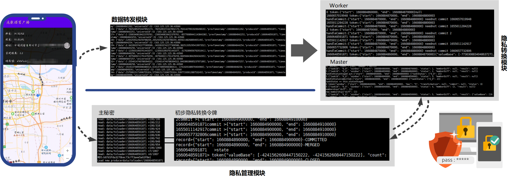

# PRIVOY demo
 

  

&emsp;&emsp;工作小组为测试系统的运行状况，开发了测试demo，其运行需要一台隐私服务器和一台数据服务器，以及一个安卓app，在本次测试中以运动app为例。  
## 准备阶段
&emsp;&emsp;首先工作小组在数据服务器上部署了kafka平台，并部署了本系统提供的master、worker和netty三个jar包；其次，工作小组在隐私服务器部署了本系统提供的(不知道名字)jar包；接着，将安卓程序连接…arr包；最后，将所有jar包全部启动，完成系统的所有准备工作。

## 正式使用
&emsp;&emsp;正式使用时，启动安卓app可以看到位置、运动的距离以及代表其身份唯一标志的哈希值。在开始运动后，可以看到所有部署的jar包都处于运行状态，netty运行中显示出不断被转发的经过加密的密文流数据，worker和master运行中显示出不断变化的窗口状态。在这个过程中，隐私信息被不断转换为符合隐私的数据视图，在kafka的…主题中可以看到这些信息。

## 隐私查询
&emsp;&emsp;为查询隐私使用情况，可以在本网站“服务查询”板块中输入app上显示的哈希值。
